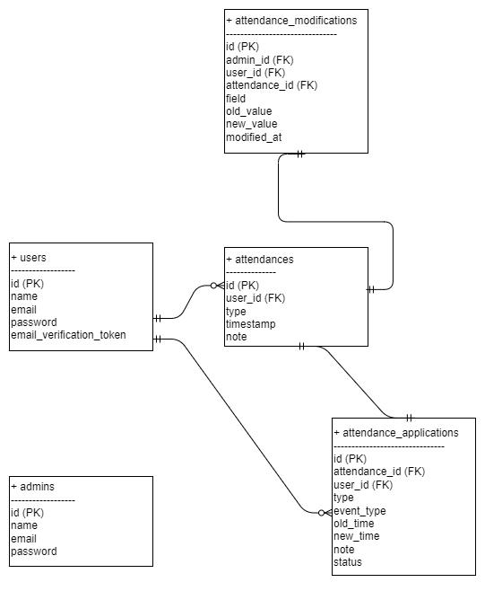

# アプリケーション名  
打刻システム(coachtech-stamping-system)  
  
## 概要  
本アプリケーションは、社会人全般を対象とした勤怠打刻管理システムです。  
スタッフによる出勤・退勤・休憩の打刻、および申請・修正依頼が可能です。  
管理者は全スタッフの勤怠状況を閲覧・承認・修正できます。 
  
## 環境構築  
[github.com:coachtech-material/laravel-docker-template.git ](https://github.com/coachtech-material/laravel-docker-template)  
laravelのディレクトリ構成はこちらからクローンして参考にさせていただいてます。  
コマンドラインで以下のコマンドを実行してください。（WindowsはUbuntuのインストールが必要です。可能な方はPCを仮想化してから実行してください）  
  
## メール認証について  
mailhogというツールを使用・導入しています。  
以下のコマンドの説明の途中で導入方法を記載いたします。  
  
ターミナルで以下のコマンドを入力してください。  
  
```bash
cd coachtech/laravel（対応している仮想環境のディレクトリ）  
git clone git@github.com:coachtech-material/laravel-docker-template.git  
mv laravel-docker-template coachtech-stamping-system  
```
  
その後Githubにてリポジトリを作成しSSHを取得します。  
  
```bash
cd coachtech-stamping-system  
git remote set-url origin git@github.com:adashinobobuko/coachtech-stamping-system.git  
```
  
その後ローカルリポジトリのデータをリモートリポジトリに反映させます。  
```bash  
git add .  
git commit -m "リモートリポジトリの変更"  
git push origin main  
```  
  
次にDockerの設定をします。  
```bash  
docker-compose build  
docker-compose up -d  
```    
  
その次にcomposerのインストールをします。  
```bash
docker-compose exec php bash  
composer install  
```  
  
composerのインストールが済んだら.envファイルの準備をします。  
```bash
cp .env.example .env  exit  
```  

.envファイルには以下のコードの記載をお願いします。  
(私の方で.env.exampleにあらかじめ記載済みのため、この工程は不要です。)  
```   
まずはデータベース部分の下３行を書き換えてください。  
DB_CONNECTION=mysql  
DB_HOST=mysql  
DB_PORT=3306  
# ここから下を書き換えてください ↓
DB_DATABASE=laravel_db  
DB_USERNAME=laravel_user  
DB_PASSWORD=laravel_pass  
```   
  
この時点でkeyの作成をお願い致します。  
.envファイルを作成したら、次にアプリケーションキーを生成します。  
```bash
docker-compose exec php artisan key:generate
```   
これを実行すると.envファイル内に  
  
APP_KEY=base64:xxxxxxxxxxxx==  
（XXXには文字の羅列が入る）  
  
という行が作られるのでこれでこのプロセスは完了です。テスト環境を閲覧できます。  
> **注意:**  
> key:generate は本番環境でも必須ですが、開発環境と本番環境でキーは別にしてください。  

## メール認証について  
上記で触れたメール認証の際のメール送信テストについてです。  
このプロジェクトではMailhogを使用しています。  
Mailhogはローカル環境でメール送信をシミュレートし、ブラウザ上で確認できるツールです。  
以下の手順でセットアップを進めてください。  

### 1.docker-compose.ymlの設定  
クローンしてきたファイルにデフォルトで存在しているdocker-compose.ymlファイルに、MailHog用のサービスを追加します。  
```yaml  
services:
  # すでにあるphpやmysqlの設定...

  mailhog:
    image: mailhog/mailhog
    container_name: mailhog
    ports:
      - "8025:8025" # ←ブラウザ用
      - "1025:1025" # ←SMTP用
```   
ここで  
・8025ポートはブラウザ画面（http://localhost:8025）用  
・1025ポートはアプリからのメール送信用　になります。  
  
### 2. .envファイルの設定  
.envに、Mailhog用のメール設定を追記・変更してください。  
（こちらについても上記同様.env.exampleファイルに記載済みです。）  
```env  
MAIL_MAILER=smtp  
MAIL_HOST=mailhog  
MAIL_PORT=1025  
MAIL_USERNAME=null  
MAIL_PASSWORD=null  
MAIL_ENCRYPTION=null  
MAIL_FROM_ADDRESS=example@example.com  
MAIL_FROM_NAME="Example"  
```   
> **注意:**  
> `MAIL_HOST=mailhog` と記載するのがポイントです。  
> docker-composeで設定したサービス名と一致させる必要があります。  
> これは送信元メールアドレス・表示名として表示されます。テスト目的であれば任意の内容で構いません。  
> このメール認証機能は、Featureテスト `MailVerifyTest` にて動作確認済みです。テスト方法に関しては後述いたします。  
  
### 3. docker-composeの再起動  
```bash  
docker-compose down  
docker-compose up -d  
```   
  
### 4.Mailhog画面の確認方法  
コンテナ起動後、以下のURLにアクセスしてください。  
http://localhost:8025  
ブラウザ上で送信されたメール一覧が確認できるようになります。  
  
### 5.シーディングについて
マイグレーションと初期データの投入をします
```bash  
docker-compose exec app php artisan migrate  
docker-compose exec app php artisan db:seed  
```  
#### 各シーダーの説明  
・AdminSeeder  
  
開発用の管理者アカウントを1件作成します：  
  
名前: 管理者  
メールアドレス: admin@example.com  
パスワード: password123  
```bash  
docker-compose exec php php artisan db:seed --class=AdminSeeder  
```  

・TestUserAttendanceSeeder  
  
以下のテスト用データを登録します：

user_id = 1 のユーザーに対して、  
2025年3月1日～31日、および 4月1日～本日 までの平日のみ  
出勤・退勤、休憩開始・終了のデータを1日分ずつ作成  
修正申請の承認されたもの（AttendanceApplication）、管理者が強制修正したもの（）

```bash  
docker-compose exec php php artisan db:seed --class=TestUserAttendanceSeeder  
```  
・DatabaseSeeder  
  
php artisan db:seed で実行されるデフォルトのシーダーです。以下をまとめて実行します：  
1.AdminSeeder を呼び出し  
2.テストユーザー（test@example.com / password）を1件作成  
3.TestUserAttendanceSeeder を呼び出し  
※テストユーザーの情報  
名前: テストユーザー  
メールアドレス: test@example.com  
パスワード: password  

### 6.ユニットテストについて　　
  
本プロジェクトでは、Laravelの PHPUnit を用いた Featureテスト を実装しています。
勤怠打刻処理・修正申請・管理者操作・メール認証（Mailhogを使用）など、システムの主要機能に対して自動テストを行うことで、機能の正当性と保守性を確保しています。  
  
使用環境：.env.testing ファイル  
テスト実行時には、.env.testing ファイルが読み込まれます。  
このファイルには、以下のようなテスト用の設定が記述されています：  
  
APP_ENV=testing（テスト環境として実行）  
DB_DATABASE=demo_test（テスト専用のデータベースを使用）  
MAIL_HOST=mailhog（Mailhogでメール送信テストが可能）  
.env 同様の構成で、アプリキーやセッション設定も含む  
  
.env.testing の内容は .env.testing.example として同梱されているため、コピーして使用できます。
```bash  
cp .env.testing.example .env.testing  
```  
  
**テストの実行方法**  
以下のコマンドで、マイグレーションとシーディングを行い、その後ユニットテストを実行できます：  
```bash
# テスト用データベースを初期化・シーディング
docker-compose exec php php artisan migrate:fresh --seed --env=testing  
# 全テストを実行  
docker-compose exec php ./vendor/bin/phpunit  
# 特定のテストだけ実行したい場合  
docker-compose exec php ./vendor/bin/phpunit --filter=テストクラス名またはメソッド名  
```  

#### 実行方法  
以下のコマンドでテストを実行できます。  

```bash  
docker-compose exec php php artisan migrate:fresh --seed  
docker-compose exec php ./vendor/bin/phpunit  

もしくは、特定のテストだけを実行するには：  
docker-compose exec php ./vendor/bin/phpunit --filter=クラス名またはメソッド名  
```  
  
**環境構築に関しては以上となります。何か疑問点ありましたらお気軽にお申し付けください。**  

## 使用技術(実行環境)
Laravel 8.83.8  
PHP 8.1.32  
mysql  Ver 15.1  
Docker
Ubuntu  
Linux  
  
## ER図  
  
  
## ルーティング構成について  

本システムでは、一般ユーザー（スタッフ）と管理者ユーザーの2種類のログイン／ルートを持っており、  
それぞれに対応したアクセス制御と画面遷移を設計しています。

### ▼ 主な構成

| 種別     | 対象       | 概要                                     |
|----------|------------|------------------------------------------|
| `/`      | 全体       | ログイン状況に応じて自動的に画面を振り分けます（スタッフ or 管理者） |
| `/login`, `/register` | スタッフ | Fortifyの仕組みを活用しつつカスタム制御しています |
| `/admin/login`        | 管理者   | 管理者専用のログインページと認証処理            |
| `/attendance/*`       | スタッフ | 打刻・詳細表示・修正申請など                    |
| `/stamp_correction_request/*` | 双方 | 修正申請に関する一覧・詳細画面など            |
| `/admin/*`            | 管理者   | 勤怠の管理、CSV出力、修正承認など               |

### ▼ 特記事項

- 一般ユーザー（staff）は `auth:web`、管理者ユーザー（admin）は `auth:admin` で認証ガードを分離しています。
- Laravel Fortify をベースに、ログイン後のリダイレクトやミドルウェア制御をカスタマイズしています。
- 模擬案件提出の都合上、ルーティングや処理の一部がコントローラーに集約されており、複雑に見える可能性があります。
  - 将来的・今後は、ルートをコントローラーごとにファイル分割したり、ルートの命名を統一したりする改善余地があります。
- 機能確認のため、ルートやパスがやや長くなる箇所がありますが、**各URLの遷移先は明確に指示通りの設計です。**
- 管理者修正モデル（AttendanceModification）とテーブル名（admin_modification）が不一致です。将来的、今後は名前をそろえるよう努めます。

---

## ルーティング一覧（抜粋）

- スタッフトップページ：`/attendance`
- 勤怠一覧：`/attendance/list`
- 勤怠詳細：`/attendance/{id}`
- 修正申請一覧：`/stamp_correction_request/list`
- 修正申請詳細：`/application/detail/{id}`

- 管理者トップページ：`/admin/attendance/list`
- 管理者用スタッフ勤怠表示：`/admin/attendance/staff/{id}`
- 勤怠CSV出力：`/admin/attendance/{id}/csv`
- 修正申請承認画面：`/admin/stamp_correction_request/approve/{id}`

---

### 補足：今後の改善案

- ルーティングを `routes/web.php` で1ファイルにまとめているため、ルート数が多くなるにつれ見通しが悪くなります。
- 将来的には以下のような分割も検討可能です：

```php
// routes/staff.php
// routes/admin.php
// routes/api.php

